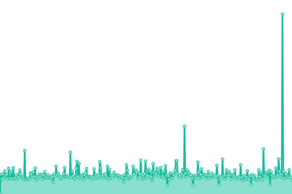
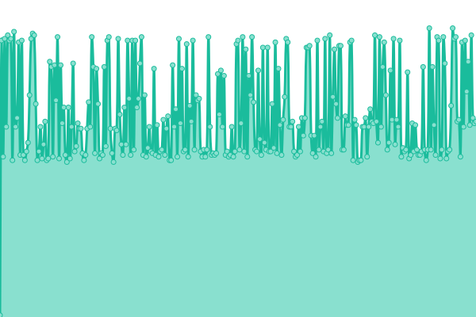

# [📈 Live Status](https://uptime.greathost.ro): <!--live status--> **🟧 Partial outage**

This repository contains the open-source uptime monitor and status page for [GreathostRo](https://uptime.greathost.ro), powered by [Upptime](https://github.com/upptime/upptime).

With [Upptime](https://upptime.js.org), you can get your own unlimited and free uptime monitor and status page, powered entirely by a GitHub repository. We use [Issues](https://github.com/GreathostRo/upptime/issues) as incident reports, [Actions](https://github.com/GreathostRo/upptime/actions) as uptime monitors, and [Pages](https://uptime.greathost.ro) for the status page.

<!--start: status pages-->
<!-- This summary is generated by Upptime (https://github.com/upptime/upptime) -->
<!-- Do not edit this manually, your changes will be overwritten -->
<!-- prettier-ignore -->
| URL | Status | History | Response Time | Uptime |
| --- | ------ | ------- | ------------- | ------ |
|  [Server Ultra](https://ultra.greathost.ro) | Down | [server-ultra.yml](https://github.com/GreathostRo/upptime/commits/HEAD/history/server-ultra.yml) | 

 873ms
     
 | 

<a href="https://uptime.greathost.ro/history/server-ultra">97.07%</a>
    

|  [Server Gaming](https://game.greathost.ro) | Down | [server-gaming.yml](https://github.com/GreathostRo/upptime/commits/HEAD/history/server-gaming.yml) | 

 1597ms
     
 | 

<a href="https://uptime.greathost.ro/history/server-gaming">96.65%</a>
    

|  [Nameserver 2](ns2.greathost.ro) | Up | [nameserver-2.yml](https://github.com/GreathostRo/upptime/commits/HEAD/history/nameserver-2.yml) | 

 158ms
     
 | 

<a href="https://uptime.greathost.ro/history/nameserver-2">100.00%</a>
    

<!--end: status pages-->

[**Visit our status website →**](https://uptime.greathost.ro)

## 📄 License

- Powered by: [Upptime](https://github.com/upptime/upptime)
- Code: [MIT](./LICENSE) © [GreathostRo](https://uptime.greathost.ro)
- Data in the `./history` directory: [Open Database License](https://opendatacommons.org/licenses/odbl/1-0/)
